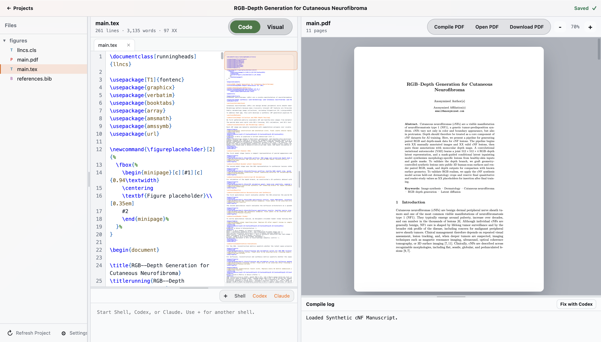

# AgentDesk

Agent-native desktop workspace for LaTeX papers, PDFs, terminals, compile logs, and review workflows.



## Run

```bash
cd agentdesk
npm install
npm start
```

The app opens to a project library. **Add Project** lets you start a blank project or import a `.tex`, folder, `.zip`, `.tar`, `.tar.gz`, or `.tgz` project. Opening a project shows the source editor on the left and a rendered PDF preview on the right. The source editor has line numbers, LaTeX syntax coloring, wrapped lines, optional Vim shortcuts, and multiple text tabs. With **Auto compile** enabled, edits are saved, compiled with `tectonic`, and pushed into the PDF preview after a short pause.

Use **Code** for raw LaTeX editing and **Visual** for page-like paragraph editing that writes back into the LaTeX source. Drag the dividers to resize the files, editor, PDF, terminal, and compile-log panes, and use the settings modal for themes, PDF rendering, keyboard shortcuts, profile details, and AGENTS.md.
